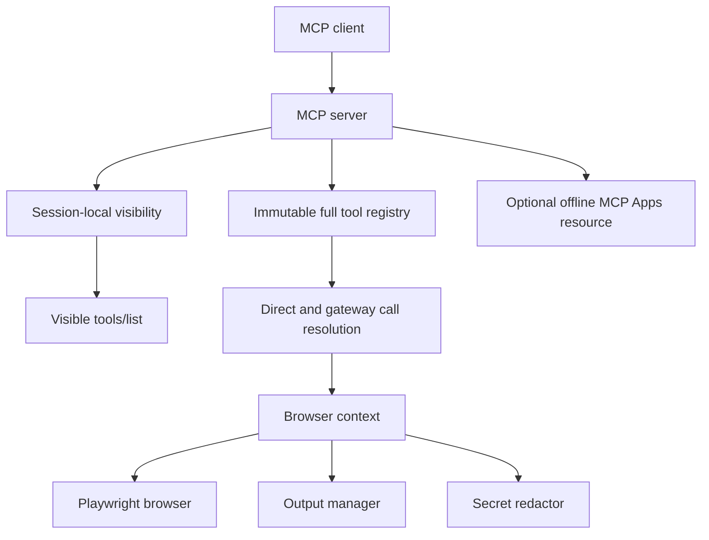

# Architecture

## Tool registry and visibility

Every configured tool is registered in one immutable `ToolRegistry`. A registration contains the tool, its capability group, aliases, search keywords, and optional upstream attribution. Registry construction rejects duplicate names, overlong descriptions, and malformed upstream source metadata.

`ToolVisibility` belongs to one `BrowserServerBackend` instance. It determines which registered tools are returned from `tools/list`:

- `adaptive` exposes seven bootstrap tools plus tools enabled during the session;
- `minimal` exposes only discovery and the read/action gateways;
- `full` exposes every capability-filtered tool.

Visibility does not control callability. The MCP call handler resolves known tool names against the complete registry so integrations with cached names remain compatible.

## Discovery and gateways

`browser_tools` searches the local registry and changes session visibility. Search is deterministic and has no external dependency.

`browser_query` accepts read-only targets. `browser_execute` accepts action and destructive targets. Both validate arguments with the target tool's Zod schema and return the target response without an additional wrapper. Gateways and batch execution cannot recursively target themselves or one another.

## Context budgets

MCP schemas are compacted once and cached by schema identity. Nested annotation prose is removed while validation constraints and literal values remain unchanged. `benchmark/tool-catalog.ts` measures the serialized profile response and CI enforces the adaptive tool-count, byte, ratio, and description-length limits.

## Browser lifecycle

Standard, remote, CDP, and extension-relay modes implement the same backend contract. Hidden tool lookup uses the complete registry in every mode.

## Output and response boundaries

Repository-managed files are reserved through `OutputManager` and finalized after writing. Cleanup is serialized, ignores symbolic links, protects the active target, and removes the oldest completed files first when a configured size limit is exceeded.

Configured secrets are redacted at the response serialization boundary. Text from direct calls and gateway calls passes through the same redactor; image bytes are not modified.

## Upstream relationship

The repository is maintained independently from Microsoft Playwright MCP. `upstream.json` records the last reviewed upstream point. The audit workflow produces a read-only artifact; it does not modify code, issues, or pull requests.

Behavior is ported selectively with a regression or conformance test and adapted to this repository's response model, selector behavior, extension support, and Ultracite/Biome rules. Upstream formatter, linter, release automation, and unrelated generated files are not merged wholesale.

## MCP Apps

The dashboard is opt-in through the `apps` capability. The server advertises the resource only when both list and read handlers are installed. Its HTML, JavaScript, and CSS are bundled into one generated resource with an exact-hash Content Security Policy.

The dashboard does not load remote code or poll continuously. It can request only screenshot preview, tab listing, and explicit tab selection. Page-controlled strings are rendered through DOM nodes and `textContent`.

